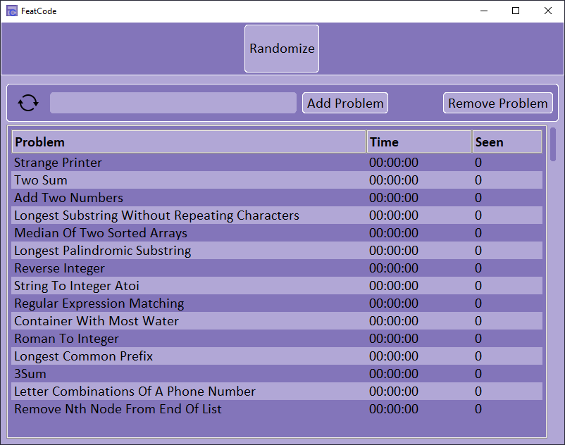
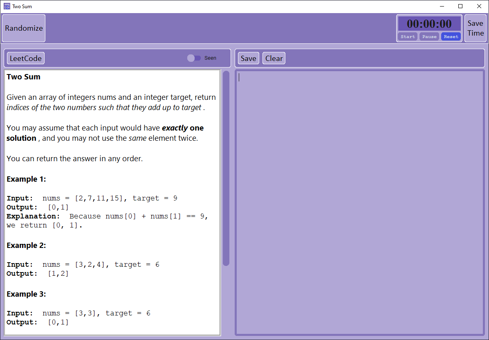
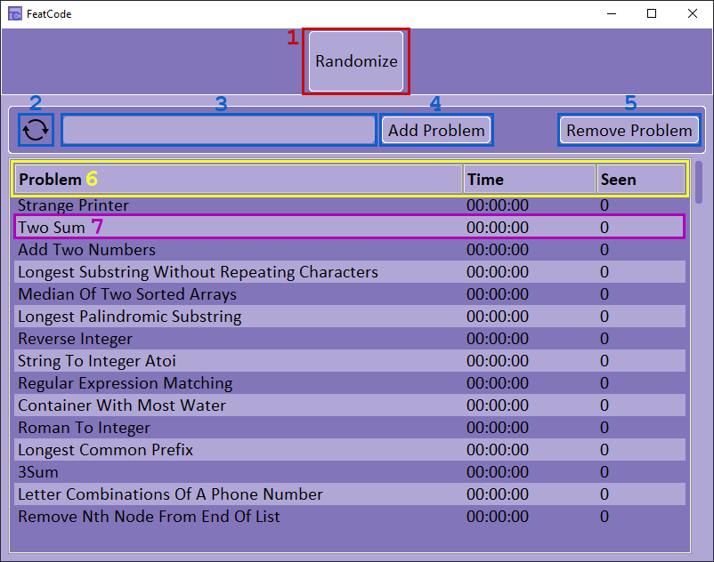
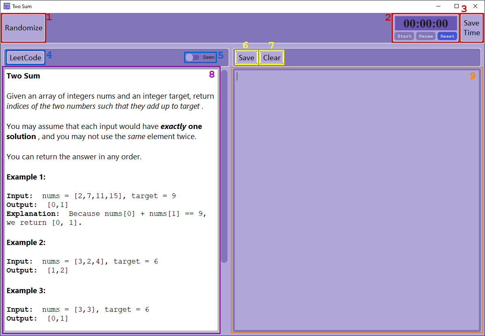

# FeatCode
A take on LeetCode that brings a more realistic interview experience into the practice space for programmers looking to hone their code solving skills a little more.

## Web-Scraping LeetCode's top interview problems with JavaScript
This JS script was pasted into the console of chrome developer tools at https://leetcode.com/problemset/all/?listId=wpwgkgt&page=1 in order to scrape all of the top interview problem urls.  The urls are then printed to the console in csv format. From there, I manually copied the script output from the console and pasted it into a .txt file called 'data/leet_urls.txt'.

```
const results = [
    ['Problem_Name','Problem_URL']
];
var urls = document.getElementsByTagName('a');
for (urlIndex in urls) {
    const url = urls[urlIndex]
    if(url.href && url.href.indexOf('://')!==-1 && url.href.includes('/problems/') && !url.href.includes('/solution')) {
        let splits = url.href.split('/')
        let name = splits[splits.length - 2].replaceAll('-', ' ')
        results.push([name, url.href])
    }
}
const csvContent = results.map((line)=>{
    return line.map((cell)=>{
        let value = cell.replace(/[\f\n\v]*\n\s*/g, "\n").replace(/[\t\f ]+/g, ' ');
        value = value.replace(/\t/g, ' ').trim();
        return `${value}`
    }).join(',')
}).join("\n");
console.log(csvContent)
```
## Data cleaning with Python
Unfortunately, some repeat problems were copied into the file so I wrote preprocess/clean_data.py to get rid of the repeats and place the cleaned dataset into a new .txt file called "data/default_urls.txt".

## Creating the PROBLEMS database with SQLite and Python
At this point I could run fc_code/init_problems_db.py to initialize and populate the PROBLEMS table using the sqlite3 library and the "data/default_urls.txt" data file.

## Front-End Development
Python's tkinter library (along with some third-party versions of tkinter including customtkinter and tkhtmlview) are used for the GUI development of the FeatCode application.  More details on the FCGUI class can be seen in the comments of 'fc_code/layout.py'.
Here are screenshots of the two application windows that make up the FeatCode UI:

### Main Window (appears on startup)


### Problem Window


## Application Usage
This section lists all of the features FeatCode provides and explains how to use them within the application.

### Main Window

#### Header Elements
1. Randomize Button: When clicked, this button creates a new problem window and brings it to the front of the screen. At the same time the main window is iconified. The problem data that fills the newly created problem window is randomly selected from the list of problems marked as 'unseen' in the dataset.
#### Table Header Elements
2. Refresh Button: The refresh button reloads the visible table.  There is no auto-refresh so if problem data is updated within a problem window, the updates will not show within the main window table until the refresh button is clicked.
3. URL Entry: A user can enter any valid LeetCode problem URL of the format 'https://leetcode.com/problems/<problem-name>/' into the entry. The best course of action is to go to a LeetCode problem webpage and copy and paste the URL into the entry.
4. Add Problem Button: Once a valid URL is in the entry, the Add Button can be clicked in order to add the problem to the dataset. FeatCode web-scrapes the problem description in html format from the given URL's webpage so that it may be displayed within a problem window.  The newly added problem will be the final entry in the visible table. If adding the problem is a success, the user is prompter with a message box, if the URL is invalid the user is prompted with an error message box. (It may take up to 15 seconds for Selenium to work it's magic)
5. Remove Problem Button: The selected problem in the visible table is removed from the dataset and all data on that problem is lost. If no problem is selected, the user is prompted with an error message box.
#### Table Headings
6. Sort Table: By clicking on any of the 3 table heading buttons, a user may sort the list of items within the table based on the column's heading that they clicked on. Clicking the 'Problem' heading sorts the table alphabetically by problem title. Clicking the 'Time' heading sorts the table by the time in ascending order.  Clicking the 'Seen' heading sorts the table by seen (1) or unseen (0) numerically in ascending order. Clicking on a heading again will reverse the order.
#### Table Items
7. Item Selection: Double-clicking on a table row will bring up it's corresponding problem window.

### Problem Window


#### Header Elements
1. Randomize Button: When clicked, this button re-populates the current problem window with a new randomly selected problem.
2. Stopwatch Widget: The stopwatch timer is a simple timer that keeps track of the user's time to complete a problem.  Click the 'start' button to begin counting, click the 'pause' button to stop counting(the 'start' button may be pressed again to start the time from where it left off). Click the 'reset' button to reset the time back to 00:00:00. The time format is HH:MM:SS.
3. Save Time Button: Saves the time displayed in the stopwatch widget to the problem's data that occupies the current problem window. This feature is good for tracking completion times for specific problems.
#### Description Header Elements
4. LeetCode Button: Opens the current problem's LeetCode webpage in the user's default web browser.
5. Seen Switch: The seen switch can be clicked to mark a problem as unseen(circle button set to left side) or seen(circle button set to right side). Marking a problem as seen takes it out of the problem set that the randomize button will pool from when clicked.
#### Text Editor Header
6. Save Button: Saves any text within the text editor to the dataset.  The user will be prompted with a question message box asking if they would like to overwrite their last save.
7. Clear Button: Clears the text editor of all text.  This does not overwrite a user's last save, so loading the current problem window again will bring any lost text back.
#### Description Box
8. Problem Description: This is the view box for the problem description.
#### Text Box
9. Text Editor: This is where a user can type in their solution to the problem.

#### Other Nice Features:
- Hovering over the center bar between the description box panel and the text box panel will change the mouse to a double arrow.  Clicking and dragging the center divider horizontally allows the user to adjust the ratio of space taken up by each panel.
- Scroll bars can be used wherever they appear.
- The mouse wheel may also be used to scroll up and down.
- The windows are completely resizable.
